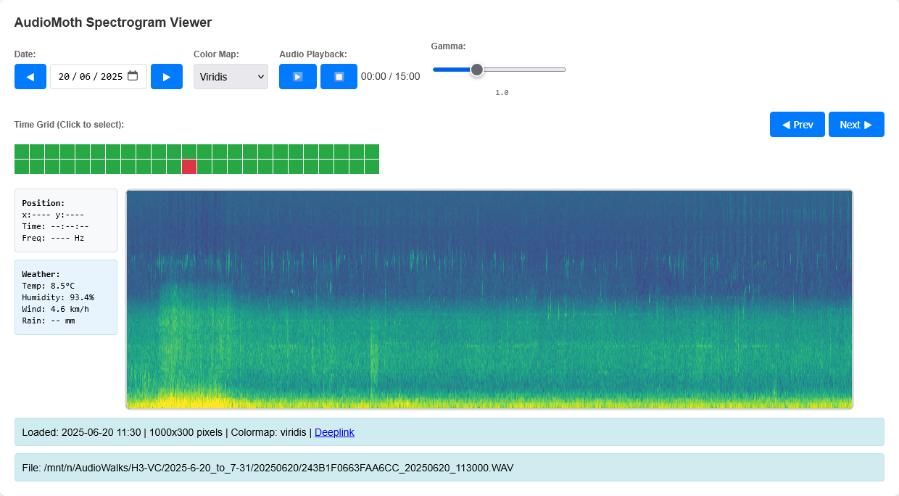

# BiophonyAI

*AI-powered soundscape analysis platform for ecological research*

[](LICENSE)
[](https://python.org)
[](https://pytorch.org)

BiophonyAI is a comprehensive bioacoustic analysis system for AudioMoth recordings, combining database management, GPU-accelerated spectrogram generation, acoustic indices calculation, and interactive web visualization. Designed for ecological research, it correlates acoustic biodiversity patterns with weather data across continuous recordings.



## 🚀 Key Features

- **🎵 AudioMoth Integration** - Native metadata parsing and optimized processing
- **⚡ GPU Acceleration** - PyTorch-based spectrogram generation (3-5x faster)
- **📊 Acoustic Indices** - Comprehensive temporal and spectral analysis (ACI, BAI, NDSI, entropy)
- **🗄️ Smart Database** - SQLite with optimized schema for large-scale datasets
- **🌐 Interactive Web Interface** - Timeline navigation, weather integration, audio playback
- **🔄 Parallel Processing** - Distributed processing with file-level locking
- **🌦️ Weather Integration** - Correlate acoustic patterns with environmental data
- **🔬 Scientific Reproducibility** - Configuration tracking and deterministic pipelines

## 📋 Quick Start

### Prerequisites
- Python 3.8+
- CUDA-compatible GPU (optional, for acceleration)
- AudioMoth recordings in organized directory structure

### Installation

```bash
# Clone the repository
git clone https://github.com/mattjoyce/biophony-ai.git
cd biophony-ai

# Install core dependencies
pip install -r requirements.txt

# Optional: Install weather integration
pip install -r requirements_weather.txt
```

### Basic Usage

1. **Initialize Database**
```bash
# Scan AudioMoth files and populate database
python3 scan_audio_database.py

# Initialize spectrogram statistics
python3 generate_spectrograms_gpu_optimized.py --config config.yaml --target 0 --dry-run
```

2. **Process Audio Data**
```bash
# Generate spectrograms (GPU-accelerated)
python3 generate_spectrograms_gpu_optimized.py --config config.yaml --target 0 1 2

# Calculate temporal indices
python3 process_acoustic_indices.py --config config.yaml --TEMPORAL --target 0 1 2

# Calculate spectral indices  
python3 process_acoustic_indices.py --config config.yaml --SPECTRAL --target 0 1 2
```

3. **Launch Web Interface**
```bash
# Start interactive viewer (http://localhost:8000)
python3 web_app.py
```

## 🏗️ Architecture

### Core Components

1. **Database Layer** (`audio_database.py`, `scan_audio_database.py`)
   - SQLite with AudioMoth metadata parsing via `metamoth`
   - Optimized schema for temporal queries and large datasets

2. **Spectrogram Engine** (`generate_spectrograms_gpu_optimized.py`)
   - GPU-accelerated mel-spectrogram generation using PyTorch
   - NPZ format storage preserving raw spectral data

3. **Acoustic Indices Processor** (`process_acoustic_indices.py`, `indices/`)
   - Modular architecture separating temporal and spectral processing
   - File-level locking for distributed processing

4. **Visualization Pipeline** (`generate_png_ultra_fast.py`)
   - High-performance PNG generation with contrast optimization
   - Acoustic indices overlays and timeline support

5. **Web Interface** (`web_app.py`)
   - Interactive Flask application with RESTful API
   - Grid-based navigation, weather integration, audio playback

## 🔧 Configuration

BiophonyAI uses YAML configuration files for flexible analysis:

### Standard Analysis (`config.yaml`)
```yaml
acoustic_indices:
  temporal:
    chunk_duration_sec: 4.5
    temporal_entropy:
      processor: temporal_entropy
    temporal_activity:
      processor: temporal_activity
      
  spectral:
    chunk_duration_sec: 4.5
    acoustic_complexity_index:
      processor: acoustic_complexity_index
    standard_bai_500-2000:
      processor: bioacoustics_index
      params:
        freq_min: 500
        freq_max: 2000
```

### Available Configurations
- `config.yaml` - Standard acoustic indices
- `config_eastern_froglet.yaml` - Species-specific analysis (2500-3500 Hz)
- `config_multi_species_frogs.yaml` - Multi-species frog monitoring
- `config_generalized_indices.yaml` - Comprehensive index set

## 📈 Acoustic Indices

### Temporal Indices (WAV-based)
- **Temporal Entropy** - Sound complexity over time
- **Temporal Activity** - Activity level, event count, amplitude statistics
- **Temporal Median** - Median amplitude analysis

### Spectral Indices (Spectrogram-based)
- **Acoustic Complexity Index (ACI)** - Frequency domain complexity
- **Bioacoustic Index (BAI)** - Species-specific frequency band analysis
- **Normalized Difference Soundscape Index (NDSI)** - Bioacoustic vs anthropogenic sounds
- **Spectral Entropy** - Frequency distribution complexity
- **Frequency Entropy** - Frequency band diversity

## ⚡ Performance & Scalability

### Parallel Processing
```bash
# Distribute processing across multiple terminals/machines
# Terminal 1:
python3 process_acoustic_indices.py --config config.yaml --SPECTRAL --target 0 1

# Terminal 2:  
python3 process_acoustic_indices.py --config config.yaml --SPECTRAL --target 2 3
```

- **Sharding System** - Files distributed using modulo 10 (`index % 10`)
- **File Locking** - Prevents concurrent processing conflicts
- **Resume Capability** - Skip already processed files automatically

### GPU Acceleration
- PyTorch/CUDA for spectrogram generation
- 3-5x performance improvement over CPU
- Automatic fallback to CPU if GPU unavailable

## 🌐 Web Interface Features

The interactive web interface provides:

- **📅 Time Grid Navigation** - Browse recordings by 30-minute slots
- **🔍 Interactive Spectrograms** - Zoom, pan, frequency tracking
- **🌡️ Weather Integration** - Temperature, humidity, wind, precipitation data
- **🔊 Audio Playback** - Direct playback with gamma adjustment
- **📊 Statistics Dashboard** - Processing status and index summaries
- **🏷️ Annotation Tools** - Manual labeling and export capabilities
- **🔗 RESTful API** - Programmatic access to all data

## 🔬 Scientific Applications

### Ecological Research Use Cases

1. **Frog Population Monitoring**
```bash
python3 process_acoustic_indices.py --config config_multi_species_frogs.yaml --SPECTRAL --target 0
```

2. **Bird Chorus Analysis**
```bash
python3 process_acoustic_indices.py --config config_generalized_indices.yaml --SPECTRAL --target 0
```

3. **Soundscape Ecology Studies**
```bash
python3 process_acoustic_indices.py --config config.yaml --TEMPORAL --SPECTRAL --target 0
```

### Weather Correlation Analysis
```python
from weather.weather_integration import WeatherIntegrator

integrator = WeatherIntegrator()
integrator.process_weather_for_database()
```

## 🗃️ Database Schema

Normalized SQLite schema optimized for acoustic analysis:

### Core Tables
- `audio_files` - AudioMoth recordings with metadata
- `acoustic_indices_core` - All acoustic index measurements  
- `annotations` - User annotations and labels
- `weather_data` / `weather_sites` - Environmental context
- `index_configurations` - Processing reproducibility tracking

See [DATABASE_DEVELOPER_GUIDE.md](DATABASE_DEVELOPER_GUIDE.md) for complete documentation.

## 📦 Dependencies

### Core Requirements
- **Python 3.8+**
- **PyTorch + torchaudio** - GPU-accelerated audio processing
- **scikit-maad** - Acoustic indices implementation
- **metamoth** - AudioMoth metadata parsing
- **Flask** - Web interface framework
- **SQLite3** - Database engine

### Scientific Computing
- **NumPy, librosa** - Audio analysis and signal processing
- **PIL/Pillow** - Image generation and manipulation
- **matplotlib** - Scientific visualization and colormaps

### Optional
- **CUDA toolkit** - GPU acceleration
- **Open-Meteo API** - Weather data integration

## 🤝 Contributing

BiophonyAI follows scientific software development practices:

1. **Code Style** - Fail-fast approach, use Pathlib, minimal error handling
2. **Testing** - Validation against known acoustic datasets
3. **Documentation** - Scientific references and comprehensive parameter docs
4. **Reproducibility** - Fixed random seeds and deterministic processing

## 📄 License

This project is licensed under the MIT License - see the [LICENSE](LICENSE) file for details.

## 📚 Citation

If you use BiophonyAI in your research, please cite:

```bibtex
@software{biophonyai2025,
  title={BiophonyAI: GPU-Accelerated Bioacoustic Analysis Platform},
  author={Joyce, Matthew},
  year={2025},
  url={https://github.com/mattjoyce/biophony-ai}
}
```

## 🙏 Acknowledgments

BiophonyAI builds upon excellent open-source projects:
- **[scikit-maad](https://github.com/scikit-maad/scikit-maad)** - Acoustic indices implementation
- **[metamoth](https://github.com/mbsantiago/metamoth)** - AudioMoth metadata parsing  
- **[PyTorch Audio](https://pytorch.org/audio/)** - GPU-accelerated audio processing
- **[Open-Meteo](https://open-meteo.com/)** - Weather data integration

## 📖 Research Documentation

### Core Analysis Guides
- **[SPECTRAL_ANALYSIS_GUIDE.md](SPECTRAL_ANALYSIS_GUIDE.md)** - Comprehensive spectral analysis capabilities, acoustic indices, and mel-scale processing
- **[WEBAPP_V2_API_GUIDE.md](WEBAPP_V2_API_GUIDE.md)** - Complete REST API documentation for research integration and custom workflows
- **[BIOACOUSTIC_TEMPORAL_ANALYSIS.md](BIOACOUSTIC_TEMPORAL_ANALYSIS.md)** - Sunrise/sunset temporal labeling and ecological time period analysis

### Developer Resources
- **[DATABASE_DEVELOPER_GUIDE.md](DATABASE_DEVELOPER_GUIDE.md)** - Database schema, views, and query optimization
- **[CLAUDE.md](CLAUDE.md)** - Project instructions and configuration guidelines

## 📞 Support

- 📖 **Documentation**: See research guides above for comprehensive analysis capabilities
- 🐛 **Issues**: [GitHub Issues](https://github.com/mattjoyce/biophony-ai/issues)
- 💬 **Discussions**: [GitHub Discussions](https://github.com/mattjoyce/biophony-ai/discussions)

---

*Advancing ecological research through AI-powered acoustic analysis* 🎵🔬
